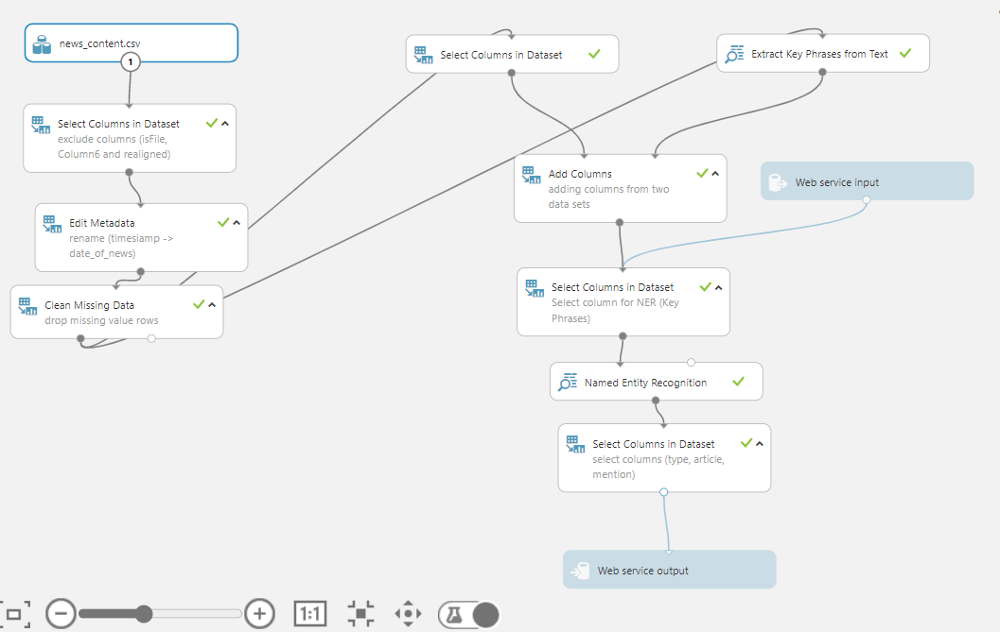
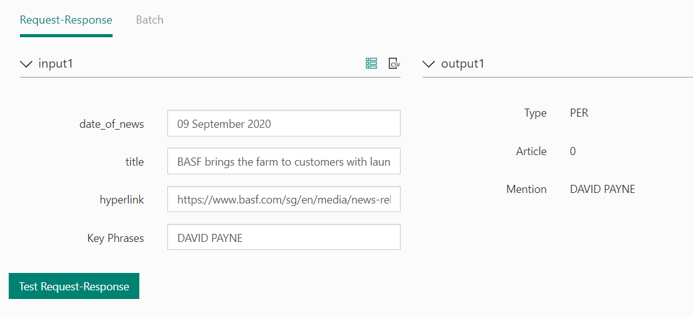

@Sarit Maitra

# Design and develop a pipeline engine

## Use case: Text Analytic and Named Entity Recognition.

The work is linked to scalable data modeling and create automated pipeline engine to 
I have done an exploratory data analysis using descriptive analytic and data modeling pipeline using Azure ML Studio workspace.
This is not a perfect solution thus far. However, this shows the way the problem can be solved.

Below are some of the screen capture of the worksoace and test module.

Above image captures a GUI driven data model and prediction workflow created on Azure ML Workspace.

Above image shows the test output. Here, by default Article 0 means 1 which can be changed to 1.

Once published, it creates tow end points:
    1. one for REQUEST/RESPONSE
    2. 2nd for BATCH EXECUTION

Source codes for both are given and can be easily identified from the file name.

Areas of improvement:
   - ML Workspace can be integrated with PowerBI for better data analysis
   - Given some more time, by using N-Gram features or LDA from key-phrases / a count-based regression model (Poisson Regression could be a good modeling application for this use-case.)
   - Below article from academic community would be a good reference point on this use case which has been cited over 4000 times so far.

Reference:
   - Mihalcea, R., & Tarau, P. (2004, July). Textrank: Bringing order into text. In Proceedings of the 2004 conference on empirical methods in natural language processing (pp. 404-411). Cited over 4000 times
